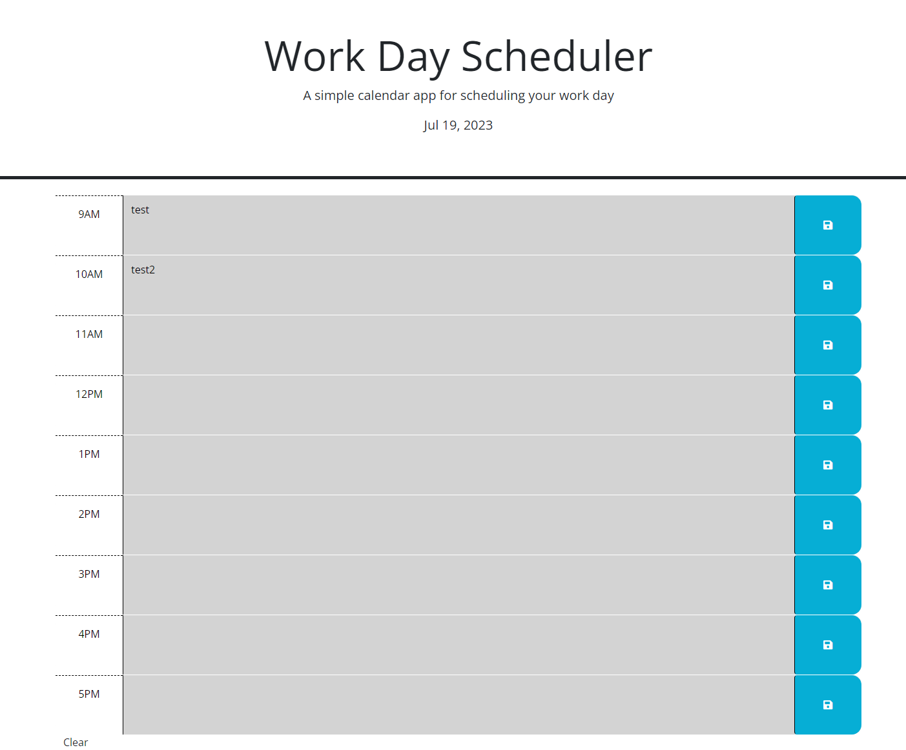

## daily-planner

# Description

I needed to create a daily planner that would display timeblocks of the past, present and future for the current day.

# Acceptance Criteria

The current day is displayed when you open the website.
There are timeblocks for a regular 9-5 workday.
The timeblocks are color-coded for past, present and future.
Clicking on a timeblock allows an entry to be input.
Clicking the save button saves the entry into local storage.
The saved entry persists after refreshing the page.

# Work Completed

The current day is displayed when you open the webpage.
There are color-coded timeblocks for a 9-5 workday.
Clicking on a timeblock allows you to input text.
Clicking on the save button saves the entry to local storage.
The saved entry persists if you refresh the page.

# Website Link

https://iqwixn.github.io/daily-planner/

# Website screenshot

